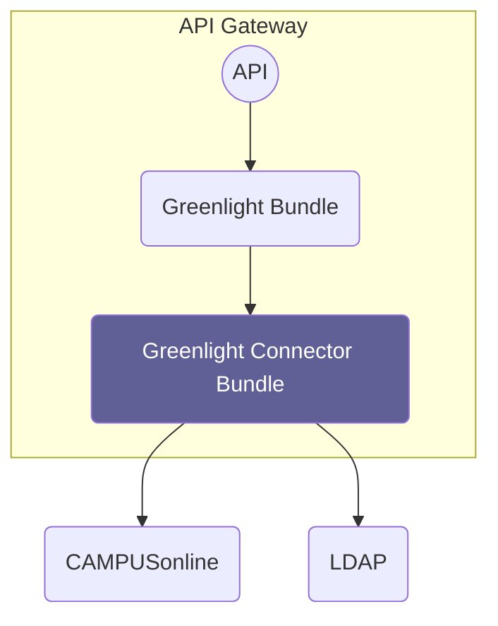

# Overview

Source: https://github.com/digital-blueprint/dbp-relay-greenlight-connector-campusonline-bundle

This bundle connects the greenlight bundle with CAMPUSonline and allows fetching
student photos from issued student cards. This makes it possible to authenticate
students visually via the frontend.

## Installation Requirements

* Access to a CAMPUSonline instance
* A configured CAMPUSonline OAuth client for the `brm.pm.extension.ucardfoto` data service
* An LDAP server for mapping user IDs to CAMPUSonline IDs.
